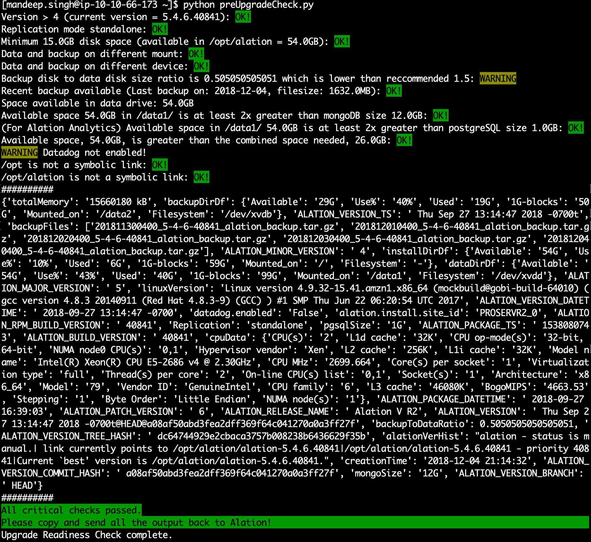

# Alation Upgrade Readiness Check

## This python script is designed to extract and analyze certain environmental variables to confirm that an Alation upgrade can proceed.

## The checks run by the script are:

    1. Alation version check
    2. Replication mode check
    3. Minimum space requirement check
    4. Data drive and backup drive space and mount point check
    5. Backup health check
    6. MongoDB health check
    7. postgreSQL size check
    8. Datadog activation check

## Instructions

For your convenience, we have developed an automated python tool to run these checks and outputs a simple file for our development team to work with. Here are the instructions to run the script:
Copy (using scp, winscp) the preUpgradeCheck.py to your home directory on the Alation instance:

    cp preUpgradeCheck.py ~/.
Or directly download the code from GitHub:

    curl https://raw.githubusercontent.com/mandeepsingh-alation/preUpgradeCheck/master/preUpgradeCheck.py --output preUpgradeCheck.py
Run the python code as sudo: (outside the Alation shell)

    sudo python preUpgradeCheck.py 
If the script ran without any errors, copy these files and send them to your CSM:

    /tmp/summary_clientID_siteID.txt
    /tmp/dataOutput_clientID_siteID.json
Please email the above files to your customer success manager.

## Example of a run:

